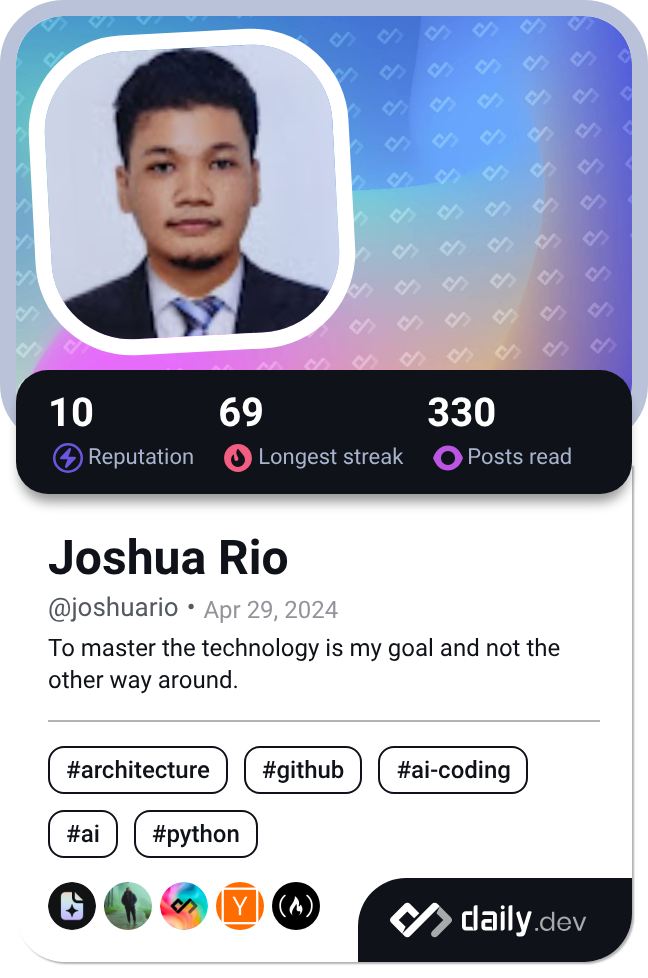

# Hi, I'm Joshua Rio! 👋
**BSIT Graduate · Full-Stack Developer · WordPress Developer · Android Developer**
 Laguna, Philippines · Open to full-time roles (Remote / Metro Manila)
 

 
---
 
## 🛠 Tech Stack
 
**Web**

 
**Mobile**

 
**Languages & Tools**

 
---
 
## 🚀 Featured Projects
 
### 🌐 [MaYo Holdings and Construction, Inc. Corporate Website](https://landing.mayogroup.biz)
Full corporate website built and deployed from local staging to live production.
- **Stack:** WordPress · Elementor · PHP · WP Super Cache · Wordfence WAF · Cloudflare · WPCode · WPForms
- **87/100** audit score, **A+** external security rating, **SEO 100/100**
- [Case study](https://joshuario.vercel.app/projects/mayo-holdings) · [Live site](https://landing.mayogroup.biz)
### 🌍 [Rio Portfolio Website](https://joshuario.vercel.app)
High-performance personal portfolio featuring MDX-powered project showcases and a serverless contact form.
- **Stack:** Next.js (App Router) · React · TypeScript · Tailwind CSS · Resend API · MDX
- [Case study](https://joshuario.vercel.app/projects/porfolio-website) · [Live site](https://joshuario.vercel.app)
### 📱 [RoadRescue](https://github.com/JRioP/RoadRescue)
Real-time Android roadside assistance app connecting stranded motorists with nearby verified service providers.
- **Stack:** Java · Firebase (Firestore, Auth, Cloud Functions) · Google Maps SDK · OAuth 2.0 · AES-256 · Room Database · Retrofit · Figma
- Live GPS tracking, automated matching, and secure payments
- [Case study](https://joshuario.vercel.app/projects/roadrescue) · [GitHub](https://github.com/JRioP/RoadRescue)
---
 
## 💼 Experience
 
**IT Intern (OJT) — MaYo Holdings and Construction, Inc.** · 2026
- Completed a 486-hour internship; built and deployed a full corporate website from local staging to live production, including DNS configuration, server redirects, and post-migration database search-and-replace.
- Optimized site performance to a 92 PageSpeed score via LiteSpeed Cache, WP Super Cache, and raising WP_MEMORY_LIMIT from 40MB to 512MB; secured the site with Wordfence WAF for an external A+ rating.
- Engineered a custom PHP email routing system with dynamic service-based ticketing for incoming website leads.
- Ensured full cross-platform responsiveness via custom breakpoints and consolidated 19 services into 8 structured categories.
- Provided hands-on IT support: CCTV maintenance, RJ45 crimping/LAN repair, Ricoh scanner troubleshooting, inventory management, and hybrid Zoom AV setup for company events.
---
 
## 🌍 Portfolio
Explore more of my work, including additional projects and case studies, at **[joshuario.vercel.app](https://joshuario.vercel.app)**.
 
---
 
## ⚙️ Automation
This profile uses a **GitHub Actions workflow** that runs on a daily schedule to automatically fetch and update my daily.dev developer card — keeping my reading activity and current interests synced without manual updates.
 

  

---
 
## 📜 Certifications
| Certification | Issuer | Year |
|---|---|---|
| Systems Administration | STI / Linux Professional Institute (LPI) | 2024 |
| SAP S/4HANA — SD, MM, PP, FI, CO | SAP University Alliances | 2024 |
| National IT Skills Competition — Python | iSITE Inc. | 2024 |
| Java Fundamentals | Oracle Academy | 2023 |
 
---
 
*"To master the technology is my goal and not the other way around."*
 
